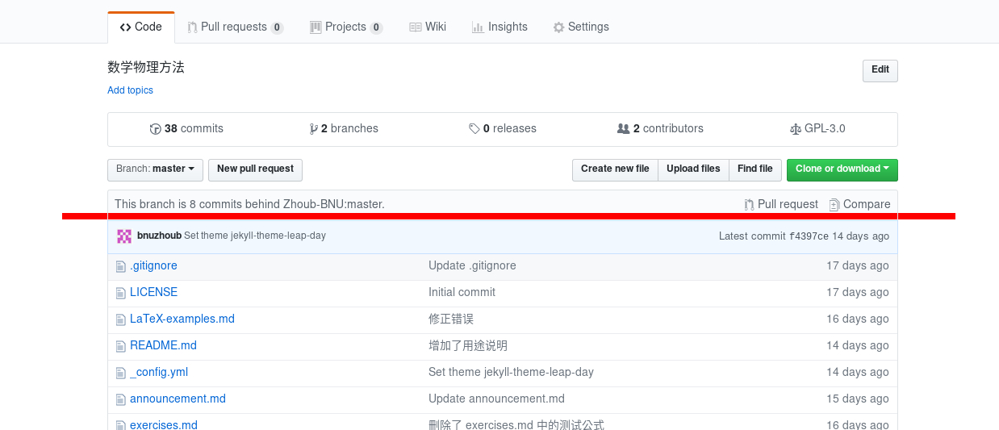

# 如何参与本教学辅助平台的讨论

要想参与本平台的讨论, 首先需要有一个 GitHub 帐号, 没有的请在
[GitHub](https://github.com) 注册 (**sign up**) 一个帐号.  免费帐号即可,
当然愿意向 GitHub 付费请自便.

**在此先声明并致歉:**
如果参与者不是听课学生, 参与一般讨论或解答问题是非常欢迎的,
但如果要问问题而且会牵涉大量数学公式的话, 限于时间而且 GitHub
对数学公式的支持不够好, 本人很可能不予解答-——不过,
话题会予以保留并欢迎热心人来解答.

**尚未加入平台的听课学生请用下述两种方法之一亮明身份:**
  - 用 issues 方式 (见下面的方法一) 在标题或具体内容的落款中标注 “选课学生 XXX”,
  其中的 XXX 为 "**听课年份 + 春/秋(学期) + 学号末6位 + 姓名首字母缩写**", 例如
  “2018春140001XML”.

  - 上述方法简单易行, 缺点是学号容易被同学知道.
  如果介意, 可把上述信息发送到我的信箱中.

## 方法一、通过 [Issues](https://github.com/Zhoub-BNU/math_phys/issues) 方式参与讨论

1. 登录 (**sign in**) 到 GitHub 上, 然后浏览 https://github.com/Zhoub-BNU/math_phys, 以下称它为**本辅助平台**.
2. 点击本辅助平台第三行中的 **Issues** 标签, 或者直接在浏览器中输入网址 https://github.com/Zhoub-BNU/math_phys/issues.
以下称这个网页为 **issues 页**.
3. 如果要发表一个新的话题, 点击 issues 页右上角的绿色的 "New issue" 按钮, 然后在 "Title" 栏内填写标题,
在 "Write" 下面填写具体内容.
    * 请尽量能让读者看完标题就大概知道具体内容在说什么, 否则读者不会有兴趣浏览该话题.
    * 如果对格式没有特别要求, 具体内容可以象编写普通文本文件一样编写; 如果有格式要求, 例如希望有*斜体字*、**黑体字**、链接等等,
    可使用 **GitHub 风格的 markdown** 格式书写.  这种格式的说明请参看
    [GitHub 的简单介绍](https://help.github.com/categories/writing-on-github).
    * 数学公式必须要用格式语言 (通常是 [LaTeX](https://en.wikipedia.org/wiki/LaTeX)) 编写, 或者贴公式图片 (很可能不行,
    没有试过).  贴一堆 LaTeX 源代码不予理会 (公式比较简短可以).  用 LaTeX 编写数学公式的例子见下面的第 5 点.
    * 在编写具体内容的过程中, 可以点击 "Preview" 预览话题发布之后所能呈现的样子.  点击 "Write" 可以继续编辑.
    * 编辑完毕后点击右下角绿色的 "Submit new issue" 按钮发表你的话题.

4. 如果要浏览一个已经存在的话题,可以点击该话题的标题.  打开之后, 如果感兴趣还可以在下面评论/回复.
评论/回复的编写要求可参看上面的第 3 点.
5. GitHub 网站虽然支持 markdown 格式, 但是对数学公式的支持不太好, 尤其是没有内建 [TeX/LaTeX](https://tug.org) 的支持.
如果要用 LaTeX 编写数学公式, 需要寻求第三方帮助, 可参考
[LaTeX-examples.md](https://github.com/Zhoub-BNU/math_phys/blob/master/LaTeX-examples.md) 中的例子.

## 方法二、通过 Fork-Push 方式参与

1. 预备工作: **这些工作只需要做一次即可.**
    * 在你自己的计算机中安装 [git](https://git-scm.com/).
    * 注册 (**sign up**) 一个 [GitHub](https://github.com) 帐号.
    * Fork 本 repository. 登录(**sign in**) 到 GitHub 上, 打开[本 repository](https://github.com/Zhoub-BNU/math_phys)
    之后, 点击右上角的 `Fork`.  这样, 你自己的 GitHub 帐号里就有了一个名为 `math_phys` 的 repository,
    以下我们称它为“`你自己的 math_phys`”, 也就是 [GitHub Help](https://help.github.com) 的
    [Working with forks](https://help.github.com/articles/working-with-forks/) 中所称的 **your fork**.
    * 把`你的 math_phys` 克隆到自己的计算机上, 参看
    [Cloning a repository](https://help.github.com/articles/cloning-a-repository/).
    * 为了能和 GitHub Help 中的操作一致, 按照
    [Configuring a remote for a fork](https://help.github.com/articles/configuring-a-remote-for-a-fork/)
    中的操作执行一次.

2. 每次提问之前要把`你的 math_phys` 与[本 repository](https://github.com/Zhoub-BNU/math_phys)
(即 GitHub Help 中所说的 **upstream repository**) 同步, 方法见
[Syncing a fork](https://help.github.com/articles/syncing-a-fork/).  之后在同一个终端/虚拟终端/命令提示符窗口中执行
```
git push origin master
```
在上述操作之前如果`你自己的 math_phys`中发现类似于下图红线上方的提示字样
```
This branch is N commits behind Zhoub-BNU:master.
```
其中 `N` 是某个数字, 那上述操作就是必须的, 否则可以不进行上述操作.

